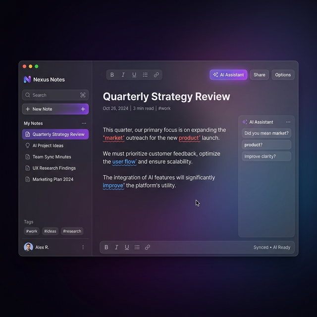

# ✦ NoteAI — Intelligent Writing Assistant

> **Elevate your writing with lightning-fast AI corrections and a premium editor experience.**

NoteAI is a high-performance, web-based writing environment designed for clarity, focus, and precision. Built with a modern tech stack and integrated with the Groq Llama-3 API, it provides real-time spelling and grammar feedback within a stunning glassmorphic interface.



## ✨ Core Features

### 🧠 Intelligent Analysis
- **Llama-Powered Grammar**: Context-aware grammar checking that understands tone and complexity.
- **Batch Spell-Checking**: Instant detection of typos with professional suggestion popovers.
- **Writing Insights**: Dynamic analysis of writing type (Email, Essay, Story, etc.) and real-time formatting tips.

### ✍️ Premium Editor Experience
- **Glassmorphic UI**: A distraction-free, elegant workspace with smooth animations and curated typography.
- **Backdrop Highlighting**: Sophisticated text-decoration system that highlights errors without interrupting your flow.
- **Focus & Zen Mode**: Minimize distractions to stay in the zone.
- **Multi-Note Management**: Seamlessly switch between notes with automatic persistence in local storage.

### 🛠 Professional Utilities
- **Find & Replace**: Advanced search with match highlighting and bulk replacement.
- **Live Word/Char/Line Stats**: Real-time tracking of your writing progress and estimated reading time.
- **Import/Export**: Easily upload `.txt` files or download your work with one click.
- **Dark/Light Mode**: Beautifully crafted themes for day or night writing.

---

## 🛠 Tech Stack

- **Backend**: [FastAPI](https://fastapi.tiangolo.com/) (Python)
- **AI Core**: [Groq AI](https://groq.com/) (Llama 3.1 8B Instant)
- **Frontend**: Vanilla JavaScript (ES6+), Modern CSS (Variables, Flexbox, Grid)
- **Linguistics**: [TextBlob](https://textblob.readthedocs.io/), [PySpellChecker](https://pypi.org/project/pyspellchecker/)

---

## 🚀 Getting Started

### Prerequisites

1.  **Groq API Key**: Obtain one from the [Groq Console](https://console.groq.com/).
2.  **Python 3.9+**

### Installation

1.  **Clone the Repository**
    ```bash
    git clone https://github.com/Abhishek-M-34/Notepad.git
    cd Notepad
    ```

2.  **Set Up Environment**
    Create a `.env` file in the root directory:
    ```env
    GROQ_API_KEY=your_api_key_here
    ```

3.  **Install Dependencies**
    ```bash
    pip install -r requirements.txt
    ```

4.  **Run the Application**
    ```bash
    python app/main.py
    ```
    Visit `http://127.0.0.1:5000` in your browser.

---

## 🎨 UI Aesthetics

NoteAI is built with a **Design-First** approach:
- **Typography**: Uses `Outfit` for the UI, `Playfair Display` for elegance, and `JetBrains Mono` for the editor.
- **Color Palette**: A deep, neutral background (`#090c12`) with vibrant violet (`#7c4dff`) accents.
- **Animations**: Subtle micro-interactions and transitions for a premium feel.

---

Designed with ❤️ by [Abhishek-M-34](https://github.com/Abhishek-M-34)
